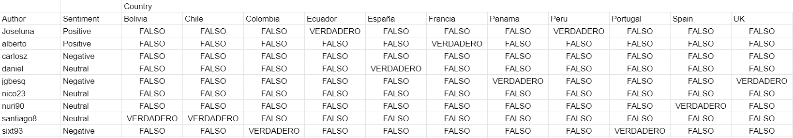
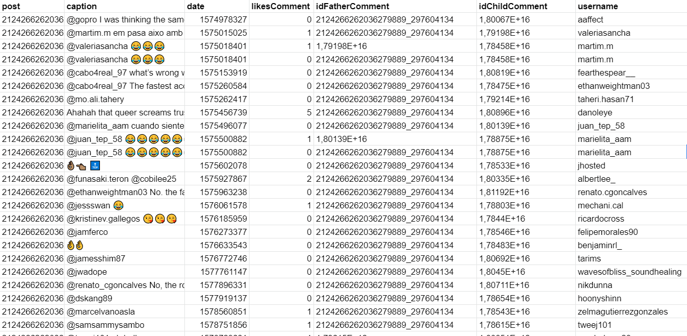

# Test de ingreso para Nodel

Este es un repositorio que contiene los 3 retos de ingreso para Nodel.

## Funcionamiento

Clonar el repositorio y ejecutar el servidor (API). La aplicación está desarrollada con flask y virtualenv para un mejor manejo de librerias.

```bash
git clone https://github.com/UpDavo/Noder_Python.git
```

Una vez clonado el repositorio, para ejecutar el servidor se debe ejecutar la siguiente serie de comandos

```bash
> . bin/activate
> pip3 install requirements.txt
> python3 ./project/main.py
```

## Usos

Existen diferentes tipos de rutas para los retos definidos.

- /setSheets
- /setInstagram
- /sendInvitations

Estas rutas pueden ser subidas a un web server como Heroku y así ser utilizadas en el backend de cualquier tipo de aplicación.

### /sendSheets

Se encarga de actualizar el documento en excel por medio de la api de Google Sheets del primer reto, tomando los datos del primer tab o Worksheet y enviando el DataFrame resultante al segundo tab.

```bash
https://docs.google.com/spreadsheets/d/15Pa8pg8W19NHKrRay7Acb3CUcllVkzpPGQoOlf0VQHs/edit?usp=sharing
```



### /setInstagram

Se encarga de actualizar un documento en excel por medio de la api de Google Sheets y enviar los comentarios de un post de instagram (Utilizando librerías de toma de datos) pre definido.

#### Nota:

El post integrado tiene una cantidad extensa de comentarios, likes y subcomentarios, por lo que por temas de pruebas y tiempos de retorno de información, se lo cerro a una cantidad limitada de retorno de data.

```bash
https://docs.google.com/spreadsheets/d/1YNdIZPGyIh7YkeMChRVg3QSc0UXahqyShQz_PfubYiA/edit?usp=sharing
```



### /sendInvitations

Se encarga de enviar invitaciones de like a la página para personas que han interactuado con un post en específico (Likes o comentarios).

#### Nota:

Graph Api de Facebook, da inconvenientes al momento de enviar las invitaciones para los usuarios, por lo que se encuentra en corrección de errores.

## Actualización

Para el segundo y tercer requerimiento por temas de Facebook Graph api, el seguimiento de toma de datos puede ser lento. esto con el objetivo de no usar selenium para el ingreso y petición de datos.

## License

[MIT](https://choosealicense.com/licenses/mit/)
